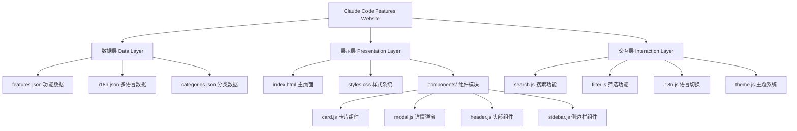
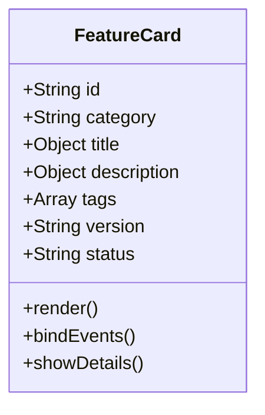
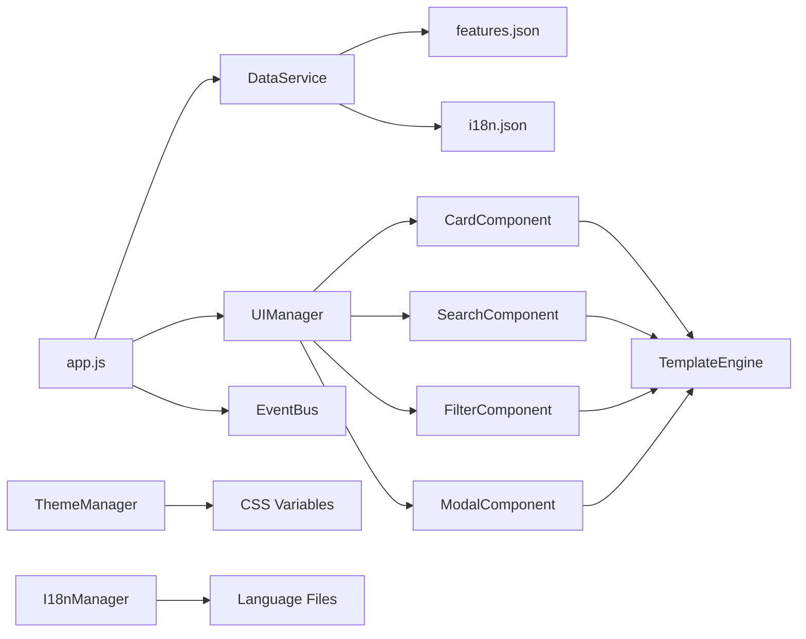
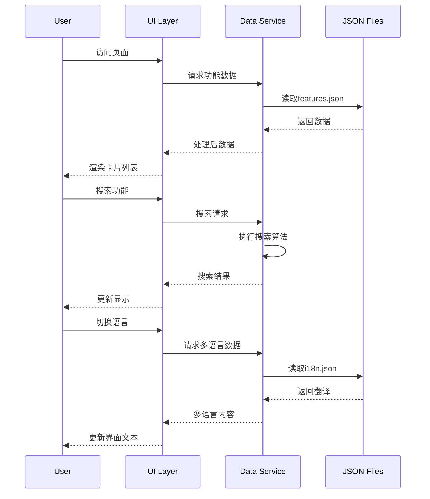

# Claude Code Features Collection - 设计文档

## 整体架构图



## 系统分层设计

### 1. 数据层 (Data Layer)
**职责**: 功能数据管理和多语言支持

**核心组件**:
- `data/features.json`: Claude Code功能特性数据
- `data/i18n.json`: 中英文翻译数据
- `data/categories.json`: 功能分类和标签数据

**数据结构**:
```json
{
  "features": [
    {
      "id": "cli-basic",
      "category": "core",
      "tags": ["cli", "basic", "command-line"],
      "title": {
        "en": "Basic CLI Operations",
        "zh": "基础CLI操作"
      },
      "description": {
        "en": "Core command line interface operations",
        "zh": "核心命令行界面操作"
      },
      "details": {
        "en": "Detailed explanation...",
        "zh": "详细说明..."
      },
      "examples": ["claude help", "claude --version"],
      "version": "2025.1",
      "status": "stable"
    }
  ]
}
```

### 2. 展示层 (Presentation Layer)
**职责**: 用户界面渲染和视觉设计

**核心组件**:
- `index.html`: 主页面结构
- `styles/main.css`: 主样式文件
- `styles/components/`: 组件样式模块
- `styles/themes/`: 主题样式系统

**设计原则**:
- Material Design卡片风格
- 响应式布局 (320px - 2560px)
- 深色/浅色主题支持
- 无障碍访问优化

### 3. 交互层 (Interaction Layer)
**职责**: 用户交互逻辑和功能实现

**核心模块**:
- `js/core/app.js`: 主应用逻辑
- `js/components/`: 组件交互逻辑
- `js/utils/`: 工具函数库
- `js/services/`: 数据服务层

## 核心组件设计

### 卡片组件 (Card Component)


**功能特性**:
- 悬停效果和点击反馈
- 标签显示和状态指示
- 详情展开/收缩
- 多语言内容切换

### 搜索组件 (Search Component)
**搜索算法**:
- 标题匹配 (权重: 100%)
- 描述匹配 (权重: 80%)
- 标签匹配 (权重: 60%)
- 内容匹配 (权重: 40%)

**搜索特性**:
- 实时搜索 (防抖300ms)
- 高亮匹配结果
- 搜索历史记录
- 模糊匹配支持

### 筛选组件 (Filter Component)
**筛选维度**:
- 功能分类 (6大类别)
- 版本标签 (2025.x系列)
- 状态标签 (stable/beta/new)
- 复杂度级别 (basic/intermediate/advanced)

## 模块依赖关系图



## 接口契约定义

### 数据服务接口
```javascript
class DataService {
    // 获取所有功能数据
    async getAllFeatures(language = 'en'): Promise<Feature[]>
    
    // 按分类获取功能
    async getFeaturesByCategory(category: string, language = 'en'): Promise<Feature[]>
    
    // 搜索功能
    async searchFeatures(query: string, language = 'en'): Promise<Feature[]>
    
    // 获取分类列表
    async getCategories(language = 'en'): Promise<Category[]>
}
```

### 组件接口
```javascript
interface Component {
    element: HTMLElement
    data: any
    render(): void
    bindEvents(): void
    destroy(): void
}
```

## 数据流向图



## 异常处理策略

### 数据加载失败
```javascript
try {
    const features = await dataService.getAllFeatures()
    renderFeatures(features)
} catch (error) {
    showErrorMessage('数据加载失败，请刷新页面重试')
    logError('Data loading failed', error)
}
```

### 搜索性能优化
- 防抖处理避免频繁请求
- 搜索结果缓存
- 分页加载大量结果
- 后台预加载常用数据

### 浏览器兼容性
- Polyfill支持旧版浏览器
- 优雅降级处理
- 功能检测而非浏览器检测

## 性能优化方案

### 加载性能
- 关键CSS内联
- 图片懒加载
- 代码分割和按需加载
- Service Worker缓存

### 运行时性能
- 虚拟滚动大列表
- 事件委托减少监听器
- RequestAnimationFrame优化动画
- Web Workers处理复杂计算

### 部署优化
- 资源压缩和合并
- CDN加速静态资源
- HTTP/2服务器推送
- 缓存策略配置

## 设计一致性规范

### 颜色系统
```css
:root {
  /* 主色调 */
  --primary-color: #6366f1;
  --primary-light: #a5b4fc;
  --primary-dark: #4338ca;
  
  /* 辅助色 */
  --secondary-color: #64748b;
  --accent-color: #f59e0b;
  --success-color: #10b981;
  --warning-color: #f59e0b;
  --error-color: #ef4444;
  
  /* 背景色 */
  --bg-primary: #ffffff;
  --bg-secondary: #f8fafc;
  --bg-card: #ffffff;
  
  /* 文本色 */
  --text-primary: #1e293b;
  --text-secondary: #64748b;
  --text-muted: #94a3b8;
}
```

### 字体系统
- 主字体: Inter, -apple-system, BlinkMacSystemFont
- 代码字体: 'Fira Code', 'Monaco', monospace
- 字号比例: 12px, 14px, 16px, 18px, 24px, 32px, 48px

### 间距系统
- 基础单位: 4px
- 间距比例: 4px, 8px, 12px, 16px, 24px, 32px, 48px, 64px

### 圆角系统
- 小圆角: 4px (按钮、标签)
- 中圆角: 8px (卡片、输入框)  
- 大圆角: 12px (模态框、大卡片)

## 可访问性支持

### ARIA标签
- 语义化HTML结构
- 适当的ARIA属性
- 屏幕阅读器支持
- 键盘导航优化

### 对比度要求
- 文本对比度 ≥ 4.5:1
- 大文本对比度 ≥ 3:1
- 交互元素对比度 ≥ 3:1

### 键盘支持
- Tab键导航顺序
- Enter/Space激活操作
- Escape键关闭弹窗
- 箭头键列表导航