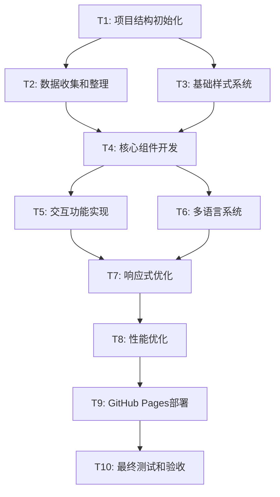

# Claude Code Features Collection - 任务分解文档

## 任务依赖图

## 原子任务详细分解

### T1: 项目结构初始化
**任务描述**: 创建完整的项目目录结构和基础文件

**输入契约**:
- 前置依赖: 设计文档已完成
- 输入数据: 项目架构规范
- 环境依赖: 文件系统写权限

**输出契约**:
- 输出数据: 完整的项目目录结构
- 交付物: HTML模板、CSS框架、JS基础文件
- 验收标准: 目录结构符合设计规范，基础文件可正常访问

**实现约束**:
- 技术栈: HTML5 + CSS3 + Vanilla JS
- 接口规范: 语义化HTML结构
- 质量要求: 文件命名规范，目录组织清晰

**依赖关系**:
- 后置任务: T2, T3
- 并行任务: 无

**估算复杂度**: 简单 (1-2小时)

---

### T2: 数据收集和整理
**任务描述**: 收集所有Claude Code功能特性，整理为结构化数据

**输入契约**:
- 前置依赖: T1完成，项目结构就绪
- 输入数据: Claude Code官方文档、功能列表
- 环境依赖: 网络访问，JSON文件支持

**输出契约**:
- 输出数据: features.json, categories.json, i18n.json
- 交付物: 结构化的功能数据文件
- 验收标准: ≥50个功能特性，6大分类完整，中英文对照

**实现约束**:
- 技术栈: JSON数据格式
- 接口规范: 统一的数据结构规范
- 质量要求: 数据准确性100%，分类逻辑清晰

**依赖关系**:
- 前置任务: T1
- 后置任务: T4, T6
- 并行任务: T3

**估算复杂度**: 中等 (3-4小时)

---

### T3: 基础样式系统
**任务描述**: 实现CSS样式系统，包括主题、组件样式、响应式布局

**输入契约**:
- 前置依赖: T1完成，HTML结构确定
- 输入数据: 设计规范、颜色系统、字体系统
- 环境依赖: CSS3支持的现代浏览器

**输出契约**:
- 输出数据: CSS样式文件系统
- 交付物: main.css, components/, themes/
- 验收标准: 样式符合设计规范，响应式布局正常

**实现约束**:
- 技术栈: CSS3, CSS Grid, Flexbox
- 接口规范: CSS变量系统，BEM命名规范
- 质量要求: 跨浏览器兼容，性能优化

**依赖关系**:
- 前置任务: T1
- 后置任务: T4, T7
- 并行任务: T2

**估算复杂度**: 中等 (4-5小时)

---

### T4: 核心组件开发
**任务描述**: 开发卡片组件、头部组件、侧边栏等核心UI组件

**输入契约**:
- 前置依赖: T2完成(数据结构)，T3完成(样式基础)
- 输入数据: 功能数据，组件设计规范
- 环境依赖: JavaScript ES6+支持

**输出契约**:
- 输出数据: JavaScript组件模块
- 交付物: card.js, header.js, sidebar.js, modal.js
- 验收标准: 组件功能正常，数据绑定正确，事件处理完善

**实现约束**:
- 技术栈: Vanilla JavaScript, DOM API
- 接口规范: 统一的组件接口规范
- 质量要求: 代码可复用，性能优化

**依赖关系**:
- 前置任务: T2, T3
- 后置任务: T5, T7
- 并行任务: 无

**估算复杂度**: 复杂 (6-8小时)

---

### T5: 交互功能实现
**任务描述**: 实现搜索、筛选、排序等交互功能

**输入契约**:
- 前置依赖: T4完成(核心组件)
- 输入数据: 搜索算法规范，筛选逻辑设计
- 环境依赖: JavaScript执行环境

**输出契约**:
- 输出数据: 交互功能模块
- 交付物: search.js, filter.js, sort.js
- 验收标准: 搜索准确率≥95%，筛选响应<100ms，用户体验流畅

**实现约束**:
- 技术栈: JavaScript算法实现
- 接口规范: 事件驱动架构
- 质量要求: 性能优化，防抖节流

**依赖关系**:
- 前置任务: T4
- 后置任务: T7, T8
- 并行任务: T6

**估算复杂度**: 复杂 (5-7小时)

---

### T6: 多语言系统
**任务描述**: 实现中英文双语切换功能

**输入契约**:
- 前置依赖: T2完成(i18n数据)，T4完成(基础组件)
- 输入数据: 多语言翻译数据
- 环境依赖: 本地存储支持

**输出契约**:
- 输出数据: 国际化系统
- 交付物: i18n.js, language-switcher.js
- 验收标准: 语言切换完整，翻译准确，状态持久化

**实现约束**:
- 技术栈: JavaScript i18n实现
- 接口规范: 多语言数据绑定规范
- 质量要求: 切换流畅，无闪烁

**依赖关系**:
- 前置任务: T2, T4
- 后置任务: T7
- 并行任务: T5

**估算复杂度**: 中等 (3-4小时)

---

### T7: 响应式优化
**任务描述**: 优化移动端体验，完善响应式布局

**输入契约**:
- 前置依赖: T3(基础样式)，T4(核心组件)，T5(交互功能)，T6(多语言)
- 输入数据: 移动端设计规范
- 环境依赖: 多设备测试环境

**输出契约**:
- 输出数据: 响应式样式优化
- 交付物: 优化的CSS和JS文件
- 验收标准: 320px-2560px完美适配，移动端体验良好

**实现约束**:
- 技术栈: CSS媒体查询，触摸事件处理
- 接口规范: 响应式设计原则
- 质量要求: 性能优化，用户体验一致

**依赖关系**:
- 前置任务: T3, T4, T5, T6
- 后置任务: T8
- 并行任务: 无

**估算复杂度**: 中等 (4-5小时)

---

### T8: 性能优化
**任务描述**: 实现加载优化、运行时优化、资源压缩等性能优化

**输入契约**:
- 前置依赖: T7完成(功能完整)
- 输入数据: 性能基准测试结果
- 环境依赖: 性能分析工具

**输出契约**:
- 输出数据: 性能优化版本
- 交付物: 压缩的资源文件，优化的代码
- 验收标准: 加载时间<3秒，Lighthouse评分≥90

**实现约束**:
- 技术栈: 性能优化技术
- 接口规范: Web性能标准
- 质量要求: 不影响功能，用户体验提升

**依赖关系**:
- 前置任务: T7
- 后置任务: T9
- 并行任务: 无

**估算复杂度**: 中等 (3-4小时)

---

### T9: GitHub Pages部署
**任务描述**: 配置GitHub Pages部署，设置自动化流程

**输入契约**:
- 前置依赖: T8完成(性能优化版本)
- 输入数据: GitHub仓库访问权限
- 环境依赖: GitHub账号，仓库访问权限

**输出契约**:
- 输出数据: 在线可访问的网站
- 交付物: GitHub Pages配置，部署文档
- 验收标准: 网站成功部署，公网访问正常

**实现约束**:
- 技术栈: GitHub Pages，GitHub Actions
- 接口规范: 静态网站部署标准
- 质量要求: 部署稳定，访问速度快

**依赖关系**:
- 前置任务: T8
- 后置任务: T10
- 并行任务: 无

**估算复杂度**: 简单 (1-2小时)

---

### T10: 最终测试和验收
**任务描述**: 全面功能测试，性能验收，问题修复

**输入契约**:
- 前置依赖: T9完成(网站部署)
- 输入数据: 验收标准清单
- 环境依赖: 多浏览器测试环境

**输出契约**:
- 输出数据: 测试报告，问题修复
- 交付物: 最终版本网站，项目文档
- 验收标准: 所有功能正常，性能达标，无严重bug

**实现约束**:
- 技术栈: 自动化测试工具
- 接口规范: 测试覆盖标准
- 质量要求: 100%功能覆盖，用户体验优秀

**依赖关系**:
- 前置任务: T9
- 后置任务: 无
- 并行任务: 无

**估算复杂度**: 中等 (2-3小时)

## 任务执行顺序

### 第一阶段 (并行)
- T1: 项目结构初始化
- T2: 数据收集和整理 (与T3并行)
- T3: 基础样式系统 (与T2并行)

### 第二阶段 (串行)
- T4: 核心组件开发

### 第三阶段 (并行)
- T5: 交互功能实现 (与T6并行)
- T6: 多语言系统 (与T5并行)

### 第四阶段 (串行)
- T7: 响应式优化
- T8: 性能优化
- T9: GitHub Pages部署
- T10: 最终测试和验收

## 总体估算

**开发时间**: 30-40小时
**任务数量**: 10个原子任务
**关键路径**: T1 → T2 → T4 → T5 → T7 → T8 → T9 → T10
**并行优化**: T2&T3, T5&T6 可并行执行
**风险评估**: 低风险，技术栈成熟，需求明确

## 质量保证措施

1. **每个任务完成后立即测试验证**
2. **关键节点代码审查**
3. **持续集成和部署验证**
4. **用户体验测试**
5. **性能基准测试**
6. **多浏览器兼容性测试**